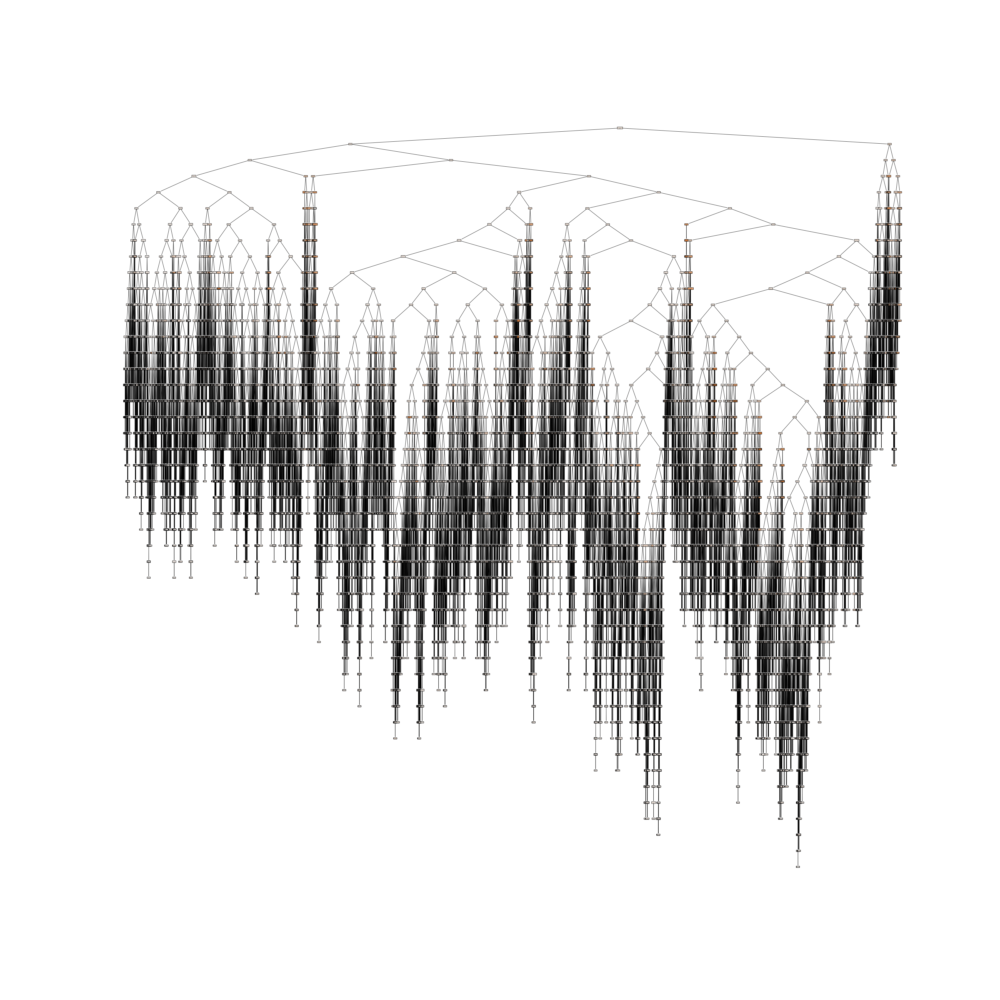

# Dudley Díaz LATAM Challenge
Este es un repositorio que contiene el análisis y exploración de datos para 
generar un modelo de estimación de retraso de vuelos.
## Principales pasos que se encuentran en el archivo **solution.ipynb**:
(Representación gráfica de modelo)

### Exploración de Datos
- [Perfil de datos](./profiling/profile_report.html):
    - Distribución de datos
    - Datos faltantes
    - Datos con colinealidad
[Relación de datos](./img/destino_finde_retraso.png)
### Selección de variables relevantes
- Correlaciones
- Eliminación estocástica
### Entrenamiento de modelos:
- Regresión lineal

- Árbol de decisión

- Random Forest

### Selección de modelo con mejor desempeño y optimización de hiperparámetros
- Grid Search
